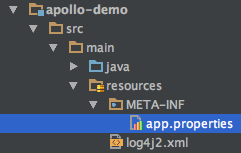

## I. Prerequisite

### I.I Requirements

* Java: 1.7+

### I.II Mandatory Setup
Apollo client requires `AppId` and `Environment` information available to function properly, so please read the following and configure them properly:

#### 1. AppId

AppId is the identity for the application, which is a key information to retrieve the config from server.

AppId information should be put in `classpath:/META-INF/app.properties` with its key as `app.id`.

For example, you could place the file as the following screenshot:



And config the file as:

> app.id=YOUR-APP-ID

#### 2. Environment

Apollo supports config by multiple environments, so environment is another key information to retrieve the config from server.

Environment could be configured in 3 ways:

1. As Java System Property
	* You could specify environment as java system property `env`
	* For example, when starting the java application, it can be configured via `-Denv=YOUR-ENVIRONMENT`
	* Please note the key should be lower case

2. As OS System Environment
	* You could also specify environment as system environment `ENV`
	* Please note the key should be UPPER CASE

3. As Property File
	* You could create a file `/opt/settings/server.properties` on the target machine
	* And specify the environment in the file as `env=YOUR-ENVIRONMENT`
	* Please note the key should be lower case

Currently, `env` allows the following values (case-insensitive):

* DEV
* FWS
* FAT
* UAT
* PRO

### I.III Optional Setup

#### Cluster

Apollo supports config separated by clusters, which means for one appId and one environment, you could have different configs.

If you need this functionality, you could specify the cluster as follows:

1. As Java System Property
	* You could specify cluster as java system property `apollo.cluster`
	* For example, when starting the java application, it can be configured via `-Dapollo.cluster=xxx`
	* Please note the key should be lower case
2. As Property file
	* You could create a file `/opt/settings/server.properties` on the target machine
	* And specify the idc cluster in the file as `idc=xxx`
	* Please note the key should be lower case

##### Cluster Precedence

1. If both `apollo.cluster` and `idc` are specified:
	* We will first try to load config from cluster specified as `apollo.cluster`
	* If not found, we will fall back to cluster specified as `idc`
	* If still not found, we will fall back to the default cluster `default`

2. If only `apollo.cluster` is specified:
	* We will first try to load config from cluster specified as `apollo.cluster`
	* If not found, we will fall back to the default cluster `default`

3. If only `idc` is specified:
	* We will first try to load config from cluster specified as `idc`
	* If not found, we will fall back to the default cluster `default`

4. If neither `apollo.cluster` nor `idc` is specified:
	* We will load config from the default cluster `default`

## II. Maven Dependency
		<dependency>
			<groupId>com.ctrip.framework.apollo</groupId>
			<artifactId>apollo-client</artifactId>
			<version>0.3.0</version>
		</dependency>

## III. Client Usage

### 1. Load config from default namespace(application)
```java
Config config = ConfigService.getAppConfig();
String someKey = "someKeyFromDefaultNamespace";
String someDefaultValue = "someDefaultValueForTheKey";
System.out.println(String.format("Value for key %s is %s", someKey, config.getProperty(someKey, someDefaultValue)));
```

### 2. Register config change listener
```java
Config config = ConfigService.getAppConfig();
config.addChangeListener(new ConfigChangeListener() {
	@Override
	public void onChange(ConfigChangeEvent changeEvent) {
		System.out.println("Changes for namespace " + changeEvent.getNamespace());
		for (String key : changeEvent.changedKeys()) {
			ConfigChange change = changeEvent.getChange(key);
			System.out.println(String.format("Found change - key: %s, oldValue: %s, newValue: %s, changeType: %s", change.getPropertyName(), change.getOldValue(), change.getNewValue(), change.getChangeType()));
		}
	}
});
```

### 3. Load config from public namespace
```java
String somePublicNamespace = "CAT";
Config config = ConfigService.getConfig(somePublicNamespace);
String someKey = "someKeyFromPublicNamespace";
String someDefaultValue = "someDefaultValueForTheKey";
System.out.println(String.format("Value for key %s is %s", someKey, config.getProperty(someKey, someDefaultValue)));
```
